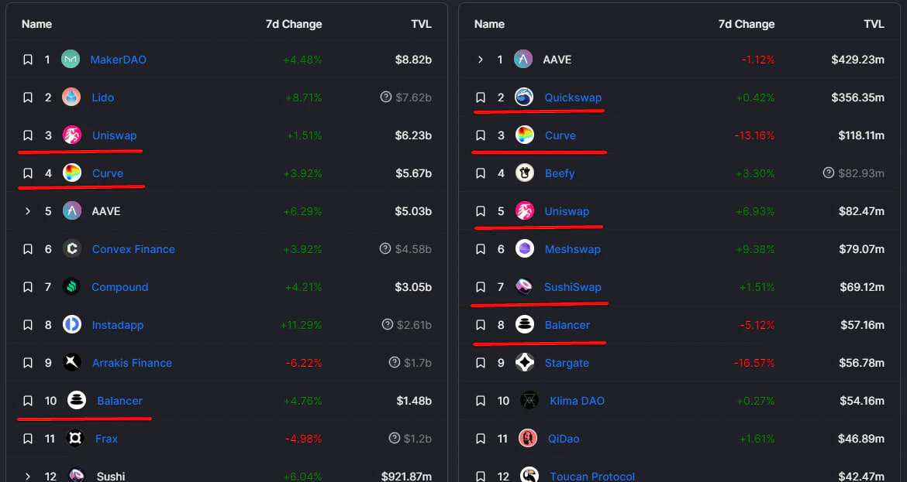
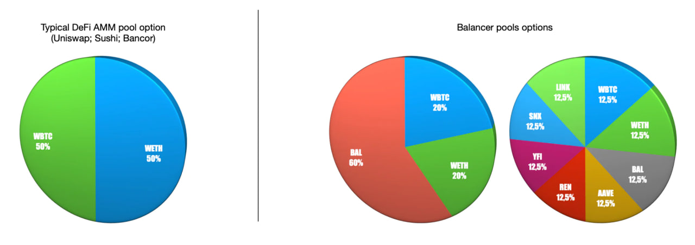
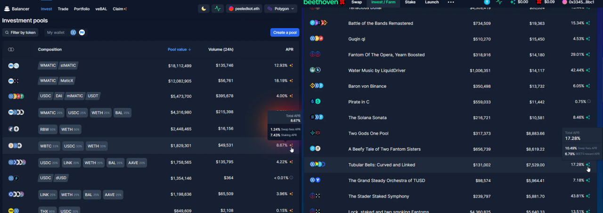
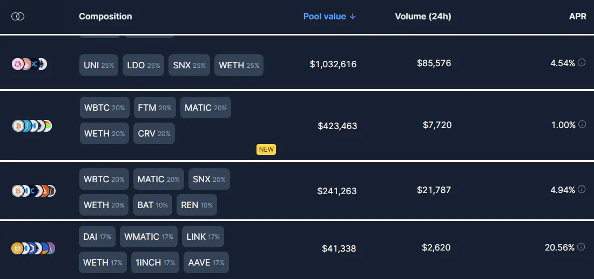

The Weighted Constant Product AMM pioneered by [Balancer](https://balancer.fi/) is arguably the best AMM model there is. It can do everything Uniswap v2 and Curve can do, and so much more, with its asymmetric and multiple token LPs.

So if Balancer’s AMM model is so good, why is it lagging so far behind competitors?

<!--truncate-->

Balancer documentation states that other than just providing liquidity, it also acts as a portfolio manager. This is actually a big deal, but for some reason Balancer DAO doesn’t give it much thought. Nowadays Balancer is just another bland and boring DEX, with almost exactly the same economics and governance as other DEXes.

In this article I’ll explain why Balancer’s incentive program sucks, and how it can be changed to make Balancer the ultimate liquidity black hole that it was intended to be.

# Intro

Balancer lets you make your whole portfolio work together. Just slap all your favorite tokens together to form a liquidity pool. Now you’re receiving swap fees, which can greatly increase your portfolio’s income.

But wait, there’s more. BAL incentives give you extra APR for providing liquidity to specific pools, just like farms on most other DEXes.

Incentives attract mercenary liquidity from other places. After SushiSwap launched its farms, it attracted vast liquidity, [which Uniswap lost](https://finematics.com/vampire-attack-sushiswap-explained/). Vampire attacks happen all the time nowadays, with each new DEX introducing its own incentives. Liquidity providers (farmers) look for the biggest APRs and regularly move their funds.

Balancer farms really shine with blue chip pools. Users can basically hold a crypto ETF and get extra rewards for it. Impermanent loss is much smaller (compared to Uniswap LP positions) thanks to diversification, and it gets covered faster by the farm’s APR.

So… Perfect, right? The DEX gets a bunch of liquidity, and users can have diversified yielding positions.

Let’s take a look at what wonderful diversified farms are offered at the moment of writing (August 2022):

- [Balancer on Ethereum](https://app.balancer.fi/)
    - None, really. It’s mostly dual pools just like in Uniswap and its forks.
- [Balancer on Polygon](https://polygon.balancer.fi/)
    - WMATIC-USDC-WETH-BAL
    - USDC-LINK-WETH-BAL-AAVE
    - LINK-WETH-BAL-AAVE
    - WBTC-USDC-WETH
- [Balancer on Arbitrum](https://arbitrum.balancer.fi/)
    - WBTC-WETH-USDC
- [BeethovenX on Fantom](https://beets.fi/) (fork of Balancer)
    - USDC-FTM-WBTC-ETH
    - FTM-WBTC-ETH
    - FTM-MATIC-SOL-AVAX-BNB
    - USDC-CRV-FTM-LINK
    - BNB-USDC-FTM
    - SOL-USDC-FTM
    - FTM-SPELL-MIM-ICE

Hold on a minute, these farms suck! Why is there such little variety? Balancer calls itself a portfolio manager — I can’t be the only one who thinks that they should leverage on this idea.

BeethovenX did it a bit better but still really lacking variety. They had more interesting farms in the past, but those turned out to be unpopular too.

# How could this happen?
The reason is quite simple.

Liquidity providers only join pools they consider safe. And for that, every token in a pool must be considered safe by them. With more different tokens in a pool, the amount of interested farmers goes down exponentially.

I experienced this myself with one of BeethovenX’s farms. It was almost perfect except for one token (Sushi) which I really disliked (because it generally just goes down) so I couldn’t find myself wanting to join the pool. If I could skip it and join a pool without Sushi, I would.

The devs weren’t to blame. They wanted to include Sushi because it indeed was one of the most traded tokens, when looking at volume statistics on other DEXes of Fantom. And perhaps I was a minority in disliking Sushi.

But I wasn’t the minority in disliking the pool in general. Some people probably disliked some other tokens in the pool, and didn’t join because of that. And this happens for all other diversified pools as well.

# Can this be fixed?
Let’s try to create a better way to incentivize liquidity for Balancer pools.

You can’t create the perfect pool, as there will always be people unhappy with some token choices. Thus, the DEX will always miss out on some liquidity.

A better way would be to create a bunch of pools with farms, so users can choose one they like the most, and join that. You would average out the reward rate for each farm, so most of them would show about the same performance. But some specific farms would find their fans, and be way more popular. That’s where your DEX would find its edge against other projects.

Sadly this is not really possible in practice. Consider there are 3 tokens (A, B, C) which you want to see on your DEX. That’s 4 possible pool combinations (A-B; B-C; A-C; A-B-C). The formula for the total amount of combinations is nCr(2,k)+nCr(3,k)+…+nCr(k,k), where nCr is [combination](https://en.wikipedia.org/wiki/Combination) and k is the amount of wanted tokens. When k is 10, the amount of possible combinations is 1013. When k is 15, it’s 32752.

Your farm won’t even have that many users, and economics could get very chaotic. Managing these farms would also be a nightmare in wasted gas terms.

# The solution
There is a fundamental problem that Balancer has — it tries to copy its farms from SushiSwap farms, incentivizing specific “hardcoded” pools.

Instead of allocating reward emission to specific pools, Balancer should have allocated rewards towards specific tokens.

People would create their own custom pools AND their own custom farms. The cumulative emission towards that farm would be automatically calculated considering all individual token emissions, and their percentages in this pool.

For example, if we wanted our DEX to gain TVL in 3 specific tokens (A, B, C) then we would give out such reward emission weights:

- 1000 for A
- 1000 for B
- 1000 for C

Then 2 users create 2 different pools. The first is an A-B liquidity pool with 1 A and 1 B token inside. The second is a B-C pool with 1 B and 1 C inside.

Then, the A-B farm would get all emissions for the A token (since it’s the only provider of the A token) and half of all emissions for the B token (since it provides half of all B on the DEX). The cumulative reward weight would be 1500 for this pool at this time.

I’m not crazy when I say that I’m sure farmers will enjoy such a system. Liquidity providers already create custom pools on Balancer, even without incentives. So, just for the sake of automatic rebalancing and swap fee APRs.

Imagine how much more liquidity could be attracted if people could receive even a tiny reward rate for their favorite tokens.

---

Interesting stuff, right? This is all part of a bigger idea.

There is a very large number of crypto traders. And while institutional investors always squeeze the most value from their holding by acting as market makers, most retail investors usually just let their tokens just sit there doing nothing useful. But they could passively earn more by combing their holdings into an LP and farming incentives.

Since Balancer already has an established incentive system, it will be hard for them to pivot into something new.

That’s why me and the fellas are making a new farm for Balancer-based DEXes. We came up with a robust formula to calculate custom farm emissions.

Follow Tsundoku Finance on [Twitter](https://twitter.com/TsundokuFinance) if you want to know more. Join the [chat](https://t.me/TsundokuFinance) to discuss it.