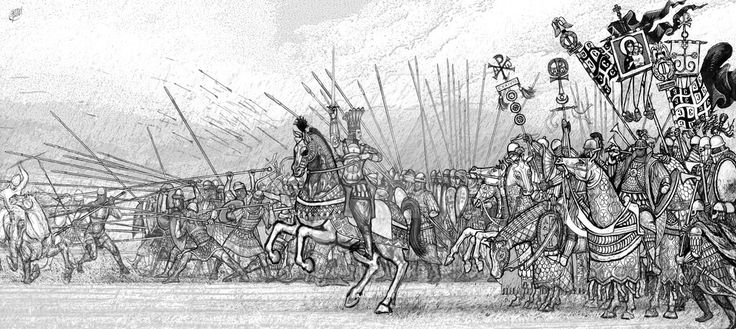
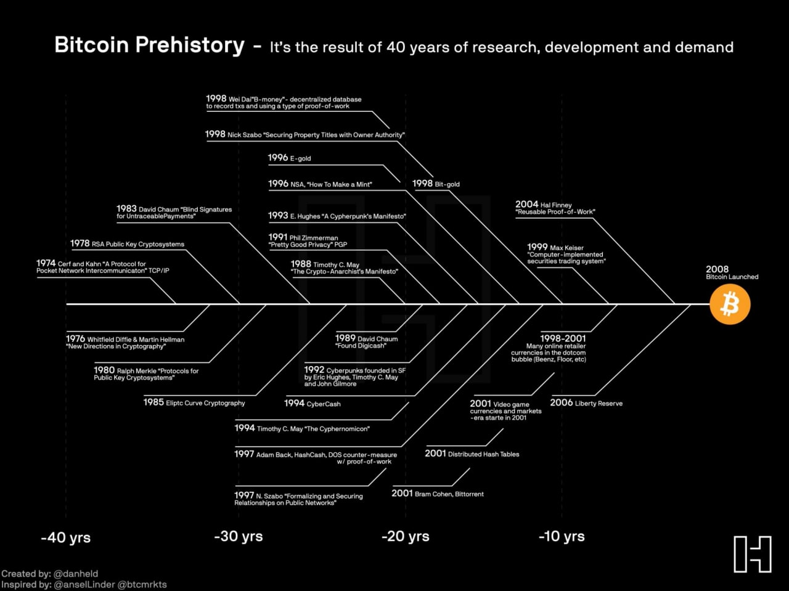

# ⛓ Blockchain

- [Crypto Glossary](https://a16z.com/2019/11/08/crypto-glossary/)
- Public key cryptography:
	- [Public Key Cryptography](https://www.youtube.com/watch?v=GSIDS_lvRv4)
	- [What is Public-key Cryptography?](https://www.globalsign.com/en/ssl-information-center/what-is-public-key-cryptography)
- Digital signatures:
	- [Cryptography Digital Signitures](https://www.tutorialspoint.com/cryptography/cryptography_digital_signatures.htm)
	- [What are Digital Signatures and How Do They Work?](https://www.youtube.com/watch?v=JR4_RBb8A9Q)
- Cryptographic hashing:
	- [What is Hashing on the Blockchain?](https://www.youtube.com/watch?v=IGSB9zoSx70)
	- [What is Hashing in Blockchain?](https://learn.bybit.com/blockchain/what-is-hashing-in-blockchain/)
- Blockchain:
	- [Blockchain Demo](https://andersbrownworth.com/blockchain/) ([as video](https://www.youtube.com/watch?v=_160oMzblY8))
	- [Blockchain Explained](https://www.investopedia.com/terms/b/blockchain.asp)
- Bitcoin:
	- [Bitcoin Whitepaper](https://bitcoin.org/bitcoin.pdf) by Satoshi Nakamoto
	- [How does Bitcoin work](https://www.youtube.com/watch?v=bBC-nXj3Ng4) by 3Blue1Brown

---

> A Byzantine general rallying his troops forward. The purpose of this isn't just to make the soldiers feel brave and excited, but also to reassure them that _everyone else_ feels brave and excited and will charge forward as well, so an individual soldier is not just committing suicide by charging forward alone.

---

- History of Bitcoin:
	- [Satoshi Nakamoto Institute](https://nakamotoinstitute.org/)

