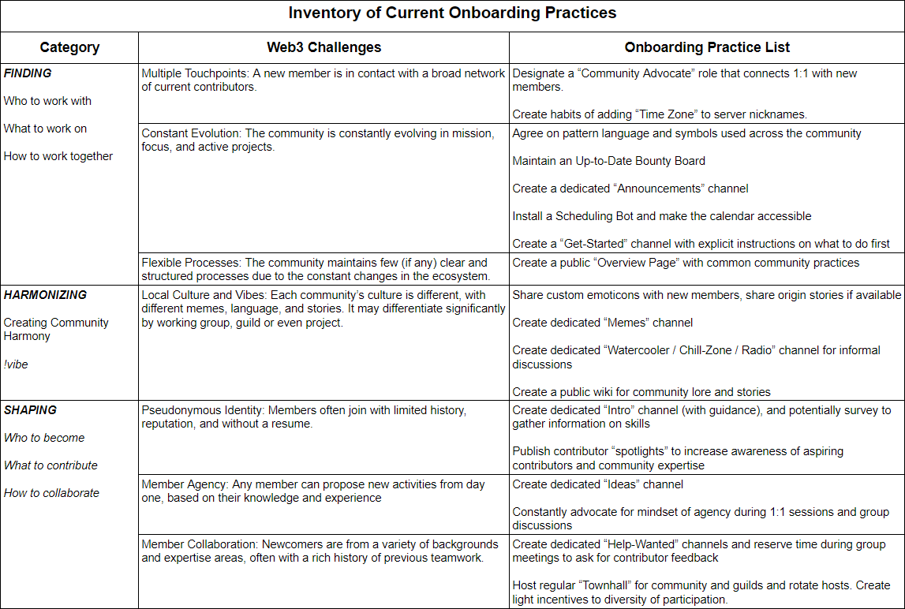
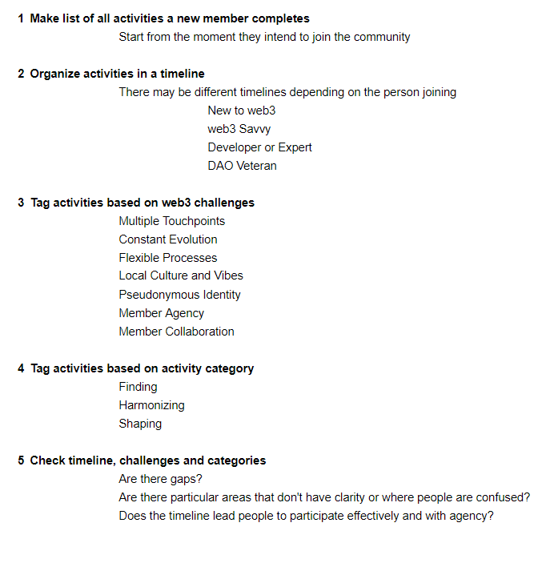

# 🌻 Community Building

# Communities
- [A Prehistory of DAOs](https://gnosisguild.mirror.xyz/t4F5rItMw4-mlpLZf5JQhElbDfQ2JRVKAzEpanyxW1Q)
- [Brick By Brick: A free guide to building awesome communities](http://www.communitybuildingguide.com/)
- [What makes a community?](https://buttondown.email/j2kun/archive/what-makes-a-community/)
- [How to build a self-sustaining web3 community](https://mirror.xyz/0xed95C841068a9feF0CE2D7F527829A231626447D/FsTyMircI_1xwg5uSMQnlBfA2Zh40gI-UFNj1-58o4Q)
- [Coordination Across Social Distance](https://community.supermodular.xyz/t/coordination-across-social-distance/124)

small communities require an organiser to keep things going

- [Best practices for community managers](http://opensource.com/business/13/12/five-community-management-tips)
- [Four types of open source communities](http://opensource.com/business/13/6/four-types-organizational-structures-within-open-source-communities)
- [Of the community, not above the community](http://opensource.com/business/11/3/community-not-above-community)
- [How to DAO 2021: Onboarding as Wayfinding](https://creators.mirror.xyz/ggSQQlTSGqJ2_U7HVNjm4f3s98on5EfUyR9rW_z3fw0)
- [orbit-model](https://github.com/orbit-love/orbit-model)
- [Principles of DAO cooperation](https://mirror.xyz/sardius.eth/caDTIJ7XL25SU8qm-6M6FE_IJUIVh7iLBkHr7eEfAvw)
- [What We Can Learn from Decentralized Community Building](https://mirror.xyz/bethanymarz.eth/AaD1J972TKT9xhzSNVFH7hCgfucB5BiQp4nWPwfyYho)

## Leveraging friend communities
- [Squad Wealth](https://otherinter.net/research/squad-wealth/)
- [Friend groups](https://nayafia.substack.com/p/27-friend-groups)

> "A group of friends who enjoy each others' company ought to build something together."

> "Let's buy a bar together."

> "Let's buy land and move to the country and raise our kids together."

- [How to build a Fren Movement](https://telegra.ph/How-to-build-a-Fren-Movement-08-16)

> "To have a good networking is essential to face the challenges of our days. Alone we are nothing."

- [Webring](https://en.wikipedia.org/wiki/Webring)

 only around 10% to 20% of people in a given community will end up being regulars

## Community lore
Local memes, shared memories.
This stuff at large scale makes nations.

- also see [Memetics, Psyops](Memetics-Psyops)
- [The Lore Zone](https://otherinter.net/research/lore/) by Other Internet
- [Why Losing Bonds Sports Fans](https://www.sapiens.org/culture/football-fans/)

Communities centered around holding a specific token are a lot like sports fans.

## Problems
- [The (3,3) mindset](https://cobie.substack.com/p/33) by Cobie
- [Groups never admit failure](https://nav.al/failure)
	- https://news.ycombinator.com/item?id=29488641
- Toxicity
	- [Toxic Positivity Is Doing More Harm Than Good](https://www.bloomberg.com/news/articles/2021-01-14/what-is-fono-toxic-positivity-is-doing-more-harm-than-good)
		- https://news.ycombinator.com/item?id=25803568
	- [Being toxic is not constructive criticism](https://github.community/t/being-toxic-is-not-constructive-criticism/10225) by Github Original Series

---

taken from [How to DAO 2021: Onboarding as Wayfinding](https://creators.mirror.xyz/ggSQQlTSGqJ2_U7HVNjm4f3s98on5EfUyR9rW_z3fw0)