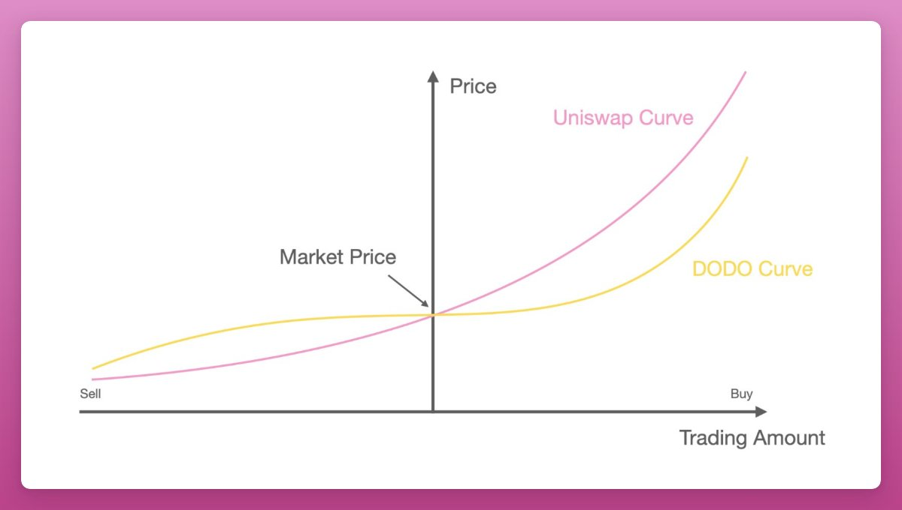

# Dodo

PMM aggregates liquidity near the market price by gathering more funds near the market price to reduce slippage. Dodo also introduced single-token provision, and liquidity pools to reduce impermanent loss.

