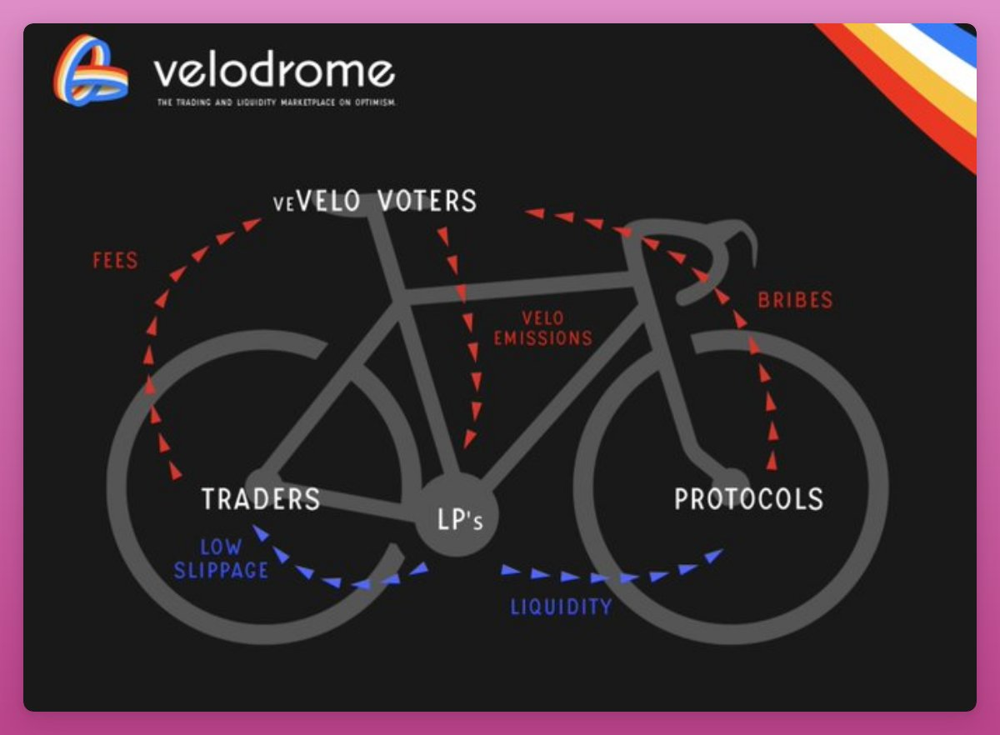

Based on Solidly but fixed some problems

- [Website](https://app.velodrome.finance/)
- [Docs](https://docs.velodrome.finance/)
- [Article on DefiLlama wiki](https://wiki.defillama.com/wiki/Velodrome)

Velodrome is an improved version of Andre Cronje's failed Solidly project. By staking VELO for up to 4 years, users get veVELO: an ERC-721 governance token in the form of an NFT, which uses ve(3,3) rebase mechanism.

Holders of veVELO receive 'bribes' for voting on emissions. It proved popular among projects on Optimism, as they can acquire liquidity cheaper than launching their own liquidity mining campaigns.